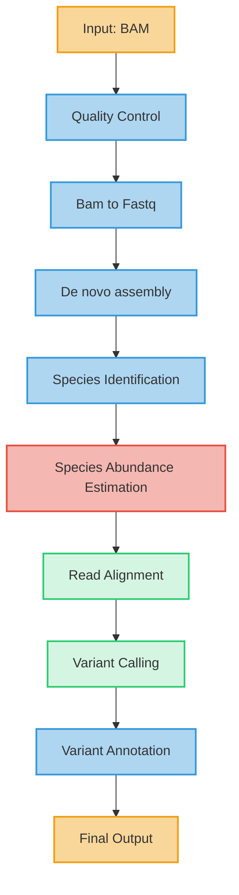

# LYSSA: A Rabies Analysis Pipeline

[](https://www.nextflow.io/)
[](https://docs.conda.io/en/latest/)
[](https://www.docker.com/)
[](https://sylabs.io/docs/)

## Introduction

This pipeline is designed for the analysis of rabies data using Pacbio MinION sequencing. It performs quality control, species identification, abundance estimation, SNP calling, and annotation.

## Pipeline summary

1. Quality control ([`FastQC`](https://www.bioinformatics.babraham.ac.uk/projects/fastqc/))
2. Species identification ([`Kraken2`](https://ccb.jhu.edu/software/kraken2/))
3. Species abundance estimation ([`Bracken`](https://ccb.jhu.edu/software/bracken/))
4. Read alignment ([`Minimap2`](https://github.com/lh3/minimap2))
5. SNP calling (choice of [`Sniffles`](https://github.com/fritzsedlazeck/Sniffles) or [`BCFtools`](https://samtools.github.io/bcftools/bcftools.html))
6. Variant annotation ([`SnpEff`](https://pcingola.github.io/SnpEff/))

## Pipeline Overview



## Quick Start

1. Install [`Nextflow`](https://www.nextflow.io/docs/latest/getstarted.html#installation) (>=23.04.0)

2. Install any of [`Docker`](https://docs.docker.com/engine/installation/), [`Singularity`](https://www.sylabs.io/guides/3.0/user-guide/), [`Podman`](https://podman.io/), [`Shifter`](https://nersc.gitlab.io/development/shifter/how-to-use/) or [`Charliecloud`](https://hpc.github.io/charliecloud/) for full pipeline reproducibility _(you can use [`Conda`](https://conda.io/miniconda.html) both to install Nextflow itself and also to manage software within pipelines. Please only use it within pipelines as a last resort; see [docs](https://nf-co.re/usage/configuration#basic-configuration-profiles))_

3. Download the pipeline and test it on a minimal dataset with a single command:

   ```bash
   nextflow run /path/to/pipeline -profile test,YOURPROFILE --outdir <OUTDIR>
   ```

## To run this pipeline with Bracken for multiple taxonomic levels, you would use:     

  ```bash
  nextflow run main.nf -profile conda \
    --input 'path/to/your/files/*.{fastq,bam}' \
    --input_format auto \
    --snp_caller bcftools \
    --kraken2_db /path/to/kraken2_db \
    --bracken_db /path/to/bracken_db \
    --read_length 150 \
    --bracken_levels 'S,G,F' \
    --outdir results
  ```
